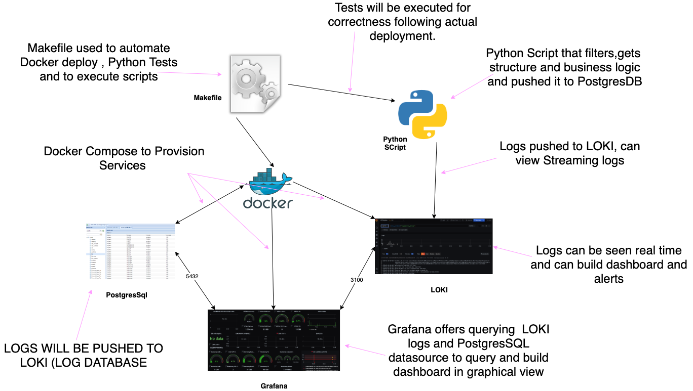
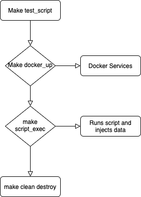

# Top Performed movies
Generate report in GRAFANA hosted in DOCKER on top performing movies by their budget to revenue ratio also Dashboard showing genres on those top 1000 movies that hosted in POSTGRES DB in Docker and through the process of calculation and processing public domain movies metadata and IMDB WIKI Data using Python3 and by PANDAS module that will run in Docker where the LOGS can be seen in LOKI from Grafana dashboard. 
Top performing 1000 movies that loaded in POSTGRES can be queried from GRAFANA using POSTGRES datasource on other datapoints on those movies for attributes. Two input files are conisdered one of them has movie metadata in ti nad other one has IMDB wiki, Filtering this independently and matching them on VIEW would git movie info like ratio, rating , budget , etc., along with wiki links so can have a closer look and get more information on those movies.
 >> title, rating, budget, year, revenue, ratio, production_companies, link , abstract
 
## Architecture



### Prerequisites
#### Python 3.6.* & Docker & GNU make

> If Docker and docker compose is not available Kindly install following below link, as major components needed them to be eixted and script can run but no output can be seen as designed to query from postgresDB .
                 
 [**Docker and Docker Compose Instalation Guide**](https://blog.51sec.org/2020/02/simplest-steps-to-install-docker-and.html)
 
 [**Python Instalation Guide**](https://www.python.org/downloads/)
 
 * NOTE: PORTS 9000, 5432, 3100 may conflict if you have services running already using those services!

## Check you have python3 & Docker installed:

```bash
python3 --version
```

#### Creating a virtual environment

Ensure your pip (package manager) is up to date:

```
pip install --upgrade pip
```

To check your pip version run:

```
pip --version
```

#### Dependencies data and INPUT

Files are required to be ingested with out decompressing as python script will take care and if you dont change names they can be git ignored
Kindly download [**MOVIE METADATA**](https://www.kaggle.com/rounakbanik/the-movies-dataset/version/7#movies_metadata.csv) please note that login is required so considering security not automated and please make sure that only CSV is downloaded, along with [**WIKI ABSTARCT**](https://dumps.wikimedia.org/enwiki/latest/enwiki-latest-abstract.xml.gz) and place them in data folder [Input Data](https://github.com/rajeshkbathula/movies_performance_report/blob/master/script/data)

## Approach Taken
* Movies metadata is CSV data and its structured, `PANDAS` offer compressed file reading into dataframe. Loading those CSV into dataframe and applying below filtering logics will gets up a straucture that analytics can be performed. when it comes to XML IMDB its huge and considering information required, will definetely hit if loaded using supported XML dataframe which make process slow as i see so made it loop through generater and line regex match applied with filtered movie df series which will also help to filter out only matched movies that has IMDB WIKI init and processing time has recordes as 15 mins for 1000 top moivies. 

## Assumptions
* release date is used to retrive year
* filtered out records which having column mismatch issues and wrong type on  budget and revenue, considering those records will not help aggrt but inspite will help performance
* consideration of records above 1000 revenue but can be changed by changing a variable in config.py
* Not filtering abstrat as more logic to put in adds more complexict.

## Filter Logic
* ratio been calculated budget div by revenue
* Year from release date
* cleaned NON ASCI title considering analytics may not support those.

#### Deployment Steps

As Shown in Architecture diagram Makefile is used to provision Docker containers and used to call python unit tests and actual script.
Below Diagram shows the flow



* be on Repo Root

1)  Command runs tests on script function test cases not database connection tests, taken care creating virtual env installing requiremnts.
```bash
make test_script 
```
Python Unittet framewotk been used to write testcases can be seen in [tests](https://github.com/rajeshkbathula/movies_performance_report/blob/master/script/test) on main script [main.py](https://github.com/rajeshkbathula/movies_performance_report/blob/master/script/main.py) , logic script  [movie_filter_logic.py](https://github.com/rajeshkbathula/movies_performance_report/blob/master/script/movie_filter_logic.py) and 
databse connection and load scripts using `psycopg2`,`sqlalchemy` python modules which are straight forward to use.


2) Brings up Docker containers Grafana, Loki, Postgres with all configured settings to view about waht they are get into docker directory
```bash
make docker_up 
```
Docker Compose is used to provision 3 resources `Grafana` , `Loki` & `postgres` file's directory  [Docker](https://github.com/rajeshkbathula/movies_performance_report/blob/master/docker) 

3) Brings up Docker containers Grafana, Loki, Postgres
```bash
make docker_up 
```
docker compose and configs have fully automated with no credentials for grafana as its not sensitive data and it hosted in local but if hosted in cloud config has to be changed

4) This runs DB connection tests along with main script functions tests following main job 
```bash
make script_exec
```
run will initiate main function and offers you link to grafana dashboard for application logs
[**GRAFANA LOGS**](http://localhost:9000/explore?orgId=1&left=%5B%22now-1h%22,%22now%22,%22loki%22,%7B%22expr%22:%22%7Bmovie_database%3D%5C%22top_revenue_movies%5C%22%7D%22%7D%5D) can be followed live by selecting top right corner option,
followed by on successful run by [**MOVIE METADATA TABLE**](http://localhost:9000/explore?orgId=1&left=%5B%22now-1h%22,%22now%22,%22postgres%22,%7B%22datasource%22:%22postgres%22,%22format%22:%22table%22,%22timeColumn%22:%22time%22,%22metricColumn%22:%22none%22,%22group%22:%5B%5D,%22where%22:%5B%7B%22type%22:%22macro%22,%22name%22:%22$__timeFilter%22,%22params%22:%5B%5D%7D%5D,%22select%22:%5B%5B%7B%22type%22:%22column%22,%22params%22:%5B%22value%22%5D%7D%5D%5D,%22rawQuery%22:true,%22rawSql%22:%22SELECT%5Cn*%5CnFROM%5Cnmovie_metadata%5Cnorder%20by%20ratio%20%20desc%5Cn%22%7D%5D) and 
[**WIKI LINKS TABLE**](http://localhost:9000/explore?orgId=1&left=%5B%22now-1h%22,%22now%22,%22postgres%22,%7B%22datasource%22:%22postgres%22,%22format%22:%22table%22,%22timeColumn%22:%22time%22,%22metricColumn%22:%22none%22,%22group%22:%5B%5D,%22where%22:%5B%7B%22type%22:%22macro%22,%22name%22:%22$__timeFilter%22,%22params%22:%5B%5D%7D%5D,%22select%22:%5B%5B%7B%22type%22:%22column%22,%22params%22:%5B%22value%22%5D%7D%5D%5D,%22rawQuery%22:true,%22rawSql%22:%22SELECT%5Cn*%5CnFROM%5Cnwiki_link;%5Cn%5Cn%22%7D%5D)
final view is presented joining 2 tables listed above
[**TOP 1000 Table with filtered columns**](http://localhost:9000/explore?orgId=1&left=%5B%22now-1h%22,%22now%22,%22postgres%22,%7B%22datasource%22:%22postgres%22,%22format%22:%22table%22,%22timeColumn%22:%22time%22,%22metricColumn%22:%22none%22,%22group%22:%5B%5D,%22where%22:%5B%7B%22type%22:%22macro%22,%22name%22:%22$__timeFilter%22,%22params%22:%5B%5D%7D%5D,%22select%22:%5B%5B%7B%22type%22:%22column%22,%22params%22:%5B%22value%22%5D%7D%5D%5D,%22rawQuery%22:true,%22rawSql%22:%22SELECT%5Cn*%5CnFROM%20top_movie_view_with_links%20order%20by%20ratio;%5Cn%5Cn%22%7D%5D)

#### CleanUP
5) Finally cleaning up after usage or destroy comletely 
```bash
make docker_down
```
This will remove python build rubbish and  pytest cache
```bash
make clean
```

#### Running tests and main program using one command

this will run tests bring up docker and run main program
```bash
make RUN
```
this will bring down docker and remove rubbish
```bash
make STOP
```


#### docker(MYSQL LOCAL DATABASE) 

```bash
make RUN-WITH-MYSQL
```
```windows
make WIN-RUN-WITH-MYSQL
```

## Roadmap
 * Json Schema support
 * Normalizing data to get more datapoints for Analytics 
 * Data quality and triming spaces on fields
 
## Authors

NAME  : RAJESH K BATHULA 
EMAIL : rajb2237@gmail.com
